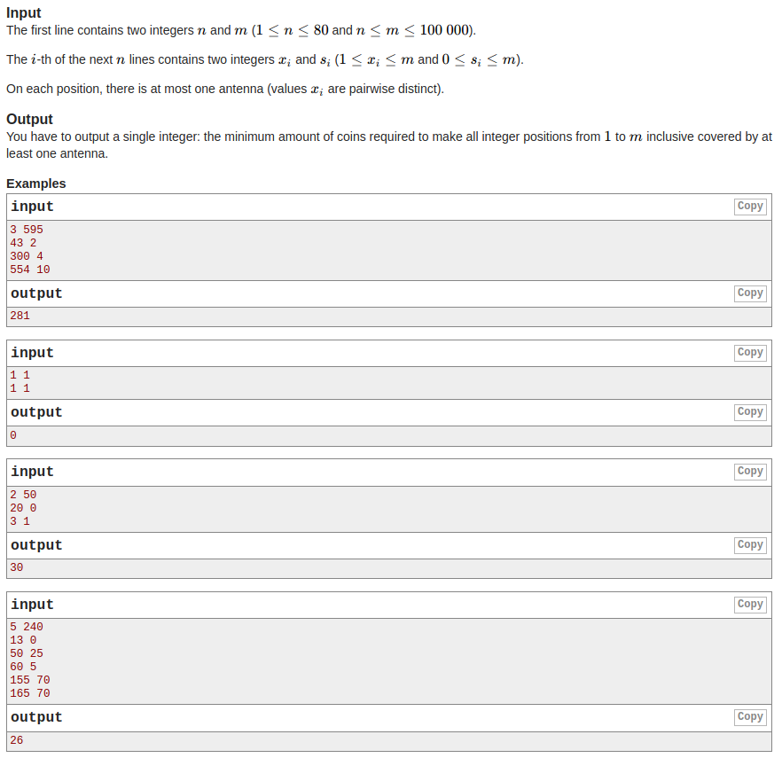

# Antenna Coverage

## How to test:
1. Clone this repository
2. `npm intsall`
3. `npm test`
## How to use:
1. Clone this repository
2. `npm intsall`
3. Example:
```javascript
const antennaCoverageCost = require('./src/index');
antennaCoverageCost(3, 595, [43, 2, 300, 4, 554, 10]); //return 281
```
##Task

